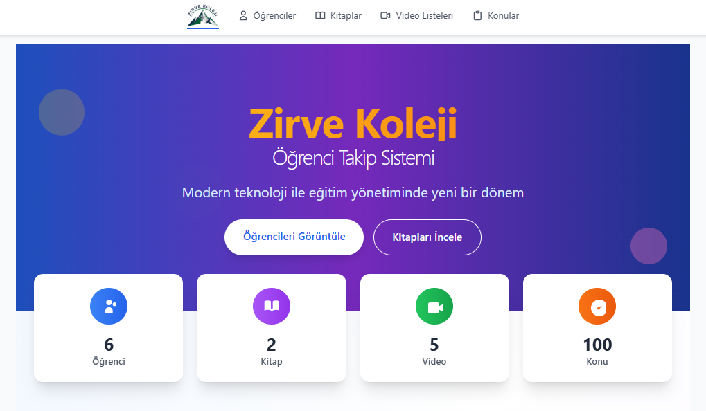

# Öğrenci Takip Sistemi

Modern teknoloji ile eğitim yönetiminde yeni bir dönem başlatın. Bu sistem, öğrenci takibi, ders planlaması, kitap yönetimi ve video ders organizasyonu için kapsamlı bir çözüm sunar.

## 📋 İçindekiler

- [Proje Hakkında](#proje-hakkında)
- [Kullanılan Teknolojiler](#kullanılan-teknolojiler)
- [Sistem Özellikleri](#sistem-özellikleri)
- [Kurulum](#kurulum)
- [Kullanım](#kullanım)
- [Sayfa Detayları](#sayfa-detayları)
- [API Endpoints](#api-endpoints)
- [Veritabanı Yapısı](#veritabanı-yapısı)
- [Geliştirme](#geliştirme)
- [Katkıda Bulunma](#katkıda-bulunma)

## 🎯 Proje Hakkında

Öğrenci Takip Sistemi, eğitim kurumları için geliştirilmiş kapsamlı bir öğrenci yönetim platformudur. Sistem, öğrenci bilgilerinin takibi, ders planlaması, kitap atamaları, video ders organizasyonu ve sınav sonuçlarının yönetimi gibi temel eğitim süreçlerini dijitalleştirir.

### Ana Amaçlar:
- Öğrenci bilgilerinin merkezi yönetimi
- Ders ve konu planlamasının sistematik takibi
- Kitap ve test atamalarının organizasyonu
- Video ders içeriklerinin yönetimi
- Sınav sonuçlarının analizi ve raporlanması
- Haftalık ve yıllık plan takibi

## 🛠 Kullanılan Teknolojiler

### Frontend
- **React 18.2.0** - Modern kullanıcı arayüzü geliştirme
- **TypeScript 4.9.5** - Tip güvenli kod yazımı
- **Tailwind CSS 3.4.1** - Utility-first CSS framework
- **React Router DOM 6.22.3** - Sayfa yönlendirme
- **Ant Design 5.26.4** - UI bileşen kütüphanesi
- **Axios 1.10.0** - HTTP istekleri
- **React Beautiful DnD 13.1.1** - Sürükle-bırak işlevselliği
- **React Toastify 11.0.5** - Bildirim sistemi
- **SweetAlert2 11.22.2** - Kullanıcı dostu uyarılar

### Backend
- **PHP 8.x** - Sunucu tarafı programlama
- **MySQL** - İlişkisel veritabanı
- **PDO** - Veritabanı bağlantı katmanı

### Geliştirme Araçları
- **Webpack 5.99.9** - Modül paketleyici
- **PostCSS 8.4.35** - CSS işleme
- **Autoprefixer 10.4.18** - CSS vendor prefix'leri
- **JSON Server 1.0.0-beta.3** - API mock servisi

## ✨ Sistem Özellikleri

### 🎓 Öğrenci Yönetimi
- Öğrenci kayıt ve bilgi güncelleme
- Bölüm türü bazlı sınıflandırma (Sayısal/Eşit Ağırlık)
- Detaylı öğrenci profilleri
- İlerleme takibi ve istatistikler

### 📚 Ders ve Konu Yönetimi
- TYT/AYT ders organizasyonu
- Konu bazlı sıralama ve düzenleme
- Sürükle-bırak ile konu sıralaması
- Ders-konu ilişkilendirmesi

### 📖 Kitap Yönetimi
- Kitap envanter yönetimi
- Konu bazlı test sayısı ataması
- Öğrenci-kitap ilişkilendirmesi
- Test tamamlama takibi

### 🎥 Video Ders Sistemi
- Eğitmen bazlı video organizasyonu
- Konu-video ilişkilendirmesi
- Video izleme takibi
- Toplu video yönetimi

### 📊 Sınav ve Değerlendirme
- Sınav sonuçlarının kaydedilmesi
- Ders bazlı sınav organizasyonu
- Sınav raporları ve yazdırma
- Performans analizi

### 📅 Planlama Sistemi
- Yıllık plan oluşturma ve takibi
- Haftalık plan organizasyonu
- Ödev takibi ve durum güncellemeleri
- Gizli ders yönetimi

## 🚀 Kurulum

### Gereksinimler
- Node.js 16.x veya üzeri
- PHP 8.x
- MySQL 5.7 veya üzeri
- XAMPP (önerilen)

### Adım 1: Projeyi İndirin
```bash
git clone https://github.com/your-username/ogrenci-otomasyon.git
cd ogrenci-otomasyon
```

### Adım 2: Backend Kurulumu
1. XAMPP'ı başlatın
2. Projeyi `htdocs` klasörüne kopyalayın
3. MySQL'de yeni bir veritabanı oluşturun:
```sql
CREATE DATABASE ogrenci_otomasyon CHARACTER SET utf8mb4 COLLATE utf8mb4_turkish_ci;
```

### Adım 3: Frontend Kurulumu
```bash
# Bağımlılıkları yükleyin
npm install

# Geliştirme sunucusunu başlatın
npm start
```

### Adım 4: Veritabanı Yapılandırması
1. `api/config/database.php` dosyasında veritabanı bilgilerini güncelleyin
2. Veritabanı tabloları otomatik olarak oluşturulacaktır

## 📱 Kullanım

### Sistem Başlatma
1. XAMPP'ı başlatın (Apache ve MySQL)
2. Frontend geliştirme sunucusunu başlatın: `npm start`
3. Tarayıcıda `http://localhost:3000` adresine gidin

### Temel İşlemler
1. **Öğrenci Ekleme**: Ana sayfadan "Öğrencileri Görüntüle" → "+" butonu
2. **Ders Planlama**: Konular sayfasından konu ekleme ve sıralama
3. **Kitap Atama**: Kitaplar sayfasından kitap oluşturma ve test ataması
4. **Video Yönetimi**: Videolar sayfasından eğitmen ve video organizasyonu

## 📄 Sayfa Detayları

### 🏠 Ana Sayfa (`/`)

- Sistem genel istatistikleri
- Hızlı erişim butonları
- Modern ve responsive tasarım
- Animasyonlu istatistik kartları

**Özellikler:**
- Toplam öğrenci, kitap, video ve konu sayıları
- Gerçek zamanlı veri güncellemeleri
- Gradient arka plan ve modern UI
- Hızlı navigasyon linkleri

### 👥 Öğrenci Yönetimi (`/ogrenciler`)
- Öğrenci listesi ve arama
- Yeni öğrenci ekleme
- Öğrenci bilgilerini düzenleme
- Öğrenci silme (onay ile)

**Özellikler:**
- Floating Action Button ile hızlı ekleme
- Modal tabanlı form yönetimi
- Bölüm türü seçimi (Sayısal/Eşit Ağırlık)
- Responsive kart tasarımı

### 👤 Öğrenci Detay (`/ogrenci/:id`)
- Kapsamlı öğrenci profili
- Sekme tabanlı bilgi organizasyonu
- İlerleme istatistikleri
- Hızlı erişim menüleri

**Sekmeler:**
- **Bilgiler**: Temel öğrenci bilgileri ve istatistikler
- **Yıllık Plan**: Yıllık ders planlaması
- **Dersler**: Öğrenci ders atamaları
- **Video Dersler**: Video izleme takibi
- **Kitaplar**: Kitap atamaları ve test takibi
- **Haftalık Plan**: Haftalık ders organizasyonu
- **Sınavlar**: Sınav sonuçları ve raporlar

### 📚 Konular (`/konular`)
- TYT/AYT konu organizasyonu
- Ders bazlı konu filtreleme
- Sürükle-bırak ile sıralama
- Konu ekleme ve düzenleme

**Özellikler:**
- Modern buton grubu filtreleme
- Gerçek zamanlı sıralama güncellemeleri
- Konu kategorilendirmesi
- Toplu konu yönetimi

### 📖 Kitaplar (`/kitaplar`)
- Kitap envanter yönetimi
- Konu bazlı test ataması
- Kitap-detay modal sistemi
- Toplu kitap işlemleri

**Özellikler:**
- Sınav türü ve ders bazlı filtreleme
- Test sayısı atama sistemi
- Kitap düzenleme ve silme
- Responsive grid layout

### 🎥 Videolar (`/videolar`)
- Eğitmen bazlı video organizasyonu
- Konu-video ilişkilendirmesi
- Toplu video yönetimi
- Video ekleme ve düzenleme

**Özellikler:**
- Eğitmen kartları ile organizasyon
- Konu bazlı video gruplandırması
- Video listesi modal sistemi
- Toplu video işlemleri

### 📊 Yıllık Plan (`/ogrenci/:id` - Yıllık Plan sekmesi)
- Hafta bazlı ders planlaması
- Konu atama ve takibi
- Gizli ders yönetimi
- Plan yazdırma

**Özellikler:**
- 52 haftalık plan görünümü
- Ders bazlı konu ataması
- Tamamlanma durumu takibi
- Dinamik plan güncellemeleri

### 📅 Haftalık Plan (`/ogrenci/:id` - Haftalık Plan sekmesi)
- Hafta bazlı detaylı planlama
- Ödev takibi
- Ders durumu güncellemeleri
- Plan yazdırma

**Özellikler:**
- Hafta seçimi ile detay görünümü
- Ödev durumu yönetimi
- Ders tamamlama takibi
- Yazdırılabilir raporlar

## 🔌 API Endpoints

### Öğrenci API
- `GET /api/ogrenci/read.php` - Tüm öğrencileri listele
- `POST /api/ogrenci/create.php` - Yeni öğrenci ekle
- `PUT /api/ogrenci/update.php` - Öğrenci güncelle
- `DELETE /api/ogrenci/delete.php` - Öğrenci sil

### Konu API
- `GET /api/konu/read.php` - Tüm konuları listele
- `POST /api/konu/create.php` - Yeni konu ekle
- `PUT /api/konu/update.php` - Konu güncelle
- `PUT /api/konu/update_siralama.php` - Konu sıralaması güncelle
- `DELETE /api/konu/delete.php` - Konu sil

### Kitap API
- `GET /api/kitap/read.php` - Tüm kitapları listele
- `POST /api/kitap/create.php` - Yeni kitap ekle
- `PUT /api/kitap/update.php` - Kitap güncelle
- `DELETE /api/kitap/delete.php` - Kitap sil

### Video API
- `GET /api/video/read.php` - Tüm videoları listele
- `POST /api/video/create.php` - Yeni video ekle
- `PUT /api/video/update.php` - Video güncelle
- `DELETE /api/video/delete.php` - Video sil

### Öğrenci-Kitap API
- `GET /api/ogrenci-kitap/read.php` - Öğrenci kitap atamaları
- `POST /api/ogrenci-kitap/create.php` - Kitap ata
- `PUT /api/ogrenci-kitap/update.php` - Atama güncelle
- `DELETE /api/ogrenci-kitap/delete.php` - Atama sil
- `GET /api/ogrenci-kitap/print.php` - Kitap raporu yazdır

### Öğrenci-Video API
- `GET /api/ogrenci-video/read.php` - Öğrenci video atamaları
- `POST /api/ogrenci-video/create.php` - Video ata
- `PUT /api/ogrenci-video/update.php` - Atama güncelle
- `DELETE /api/ogrenci-video/delete.php` - Atama sil

### Sınav API
- `GET /api/ogrenci-sinav/read.php` - Öğrenci sınavları
- `POST /api/ogrenci-sinav/create.php` - Sınav ekle
- `PUT /api/ogrenci-sinav/update.php` - Sınav güncelle
- `DELETE /api/ogrenci-sinav/delete.php` - Sınav sil
- `GET /api/ogrenci-sinav/print.php` - Sınav raporu yazdır

### Plan API
- `GET /api/yillik-plan/read.php` - Yıllık plan verileri
- `POST /api/yillik-plan/save.php` - Plan kaydet
- `GET /api/haftalik-plan/print.php` - Haftalık plan yazdır

## 🗄 Veritabanı Yapısı

### Ana Tablolar

#### `ogrenciler`
- `id` - Birincil anahtar
- `ad` - Öğrenci adı
- `soyad` - Öğrenci soyadı
- `bolum_turu` - Bölüm türü (Sayısal/Eşit Ağırlık)
- `kayit_tarihi` - Kayıt tarihi

#### `konular`
- `id` - Birincil anahtar
- `ad` - Konu adı
- `aciklama` - Konu açıklaması
- `kategori` - Konu kategorisi (TYT/AYT:Ders)
- `siralama` - Sıralama numarası

#### `kitaplar`
- `id` - Birincil anahtar
- `ad` - Kitap adı
- `sinav_turu` - Sınav türü (TYT/AYT)
- `ders` - Ders adı
- `olusturulma_tarihi` - Oluşturulma tarihi

#### `videolar`
- `id` - Birincil anahtar
- `baslik` - Video başlığı
- `aciklama` - Video açıklaması
- `url` - Video URL'si
- `konu_id` - Konu referansı
- `sure` - Video süresi
- `izlenme_sayisi` - İzlenme sayısı
- `eklenme_tarihi` - Eklenme tarihi
- `etiketler` - Video etiketleri
- `egitmen_adi` - Eğitmen adı

### İlişki Tabloları

#### `ogrenci_ders`
- Öğrenci-ders ilişkileri
- Ödev durumu takibi
- Dönem bilgileri

#### `ogrenci_kitap`
- Öğrenci-kitap atamaları
- Atanma tarihi

#### `ogrenci_kitap_test`
- Kitap test atamaları
- Tamamlanma durumu
- Test numarası

#### `ogrenci_video`
- Öğrenci-video atamaları
- İzleme süresi
- Tamamlanma durumu

#### `ogrenci_sinav`
- Sınav sonuçları
- Puan bilgileri
- Sınav tarihi

#### `yillik_plan`
- Yıllık plan verileri
- Hafta bazlı organizasyon
- Tamamlanma durumu

## 🛠 Geliştirme

### Proje Yapısı
```
ogrenci-otomasyon/
├── api/                    # Backend API dosyaları
│   ├── config/            # Veritabanı yapılandırması
│   ├── models/            # Veri modelleri
│   ├── ogrenci/           # Öğrenci API endpoints
│   ├── konu/              # Konu API endpoints
│   ├── kitap/             # Kitap API endpoints
│   ├── video/             # Video API endpoints
│   └── ...
├── src/                   # Frontend kaynak kodları
│   ├── components/        # React bileşenleri
│   ├── pages/             # Sayfa bileşenleri
│   ├── services/          # API servisleri
│   ├── types/             # TypeScript tip tanımları
│   └── utils/             # Yardımcı fonksiyonlar
├── public/                # Statik dosyalar
└── build/                 # Production build
```

### Geliştirme Komutları
```bash
# Geliştirme sunucusunu başlat
npm start

# Production build oluştur
npm run build

# Testleri çalıştır
npm test

# Linting
npm run lint
```

### Kod Standartları
- TypeScript strict mode
- ESLint kuralları
- Prettier formatlama
- Component-based architecture
- RESTful API tasarımı

## 🤝 Katkıda Bulunma

1. Projeyi fork edin
2. Feature branch oluşturun (`git checkout -b feature/amazing-feature`)
3. Değişikliklerinizi commit edin (`git commit -m 'Add amazing feature'`)
4. Branch'inizi push edin (`git push origin feature/amazing-feature`)
5. Pull Request oluşturun

### Katkı Kuralları
- Kod standartlarına uyun
- Test yazın
- Dokümantasyonu güncelleyin
- Açıklayıcı commit mesajları yazın

## 📝 Lisans

Bu proje MIT lisansı altında lisanslanmıştır. Detaylar için `LICENSE` dosyasına bakın.


## 🙏 Teşekkürler

Bu projenin geliştirilmesinde katkıda bulunan tüm geliştiricilere teşekkür ederiz.

---

**Not**: Bu sistem eğitim kurumları için geliştirilmiştir ve sürekli geliştirilmektedir. Önerileriniz ve geri bildirimleriniz bizim için değerlidir.
